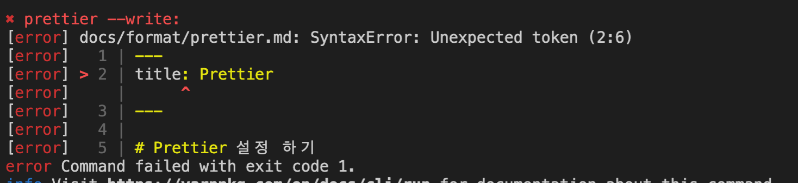

# markdown prettier 세팅

markdown에서 prettier를 세팅할 때, 만약 본인이 .prettierrc를 사용 하고 있다면 아래와 같은 에러가 뜰 수 있습니다.

`SyntaxError: Unexpected token`



이럴 때는 prettierrc에 override를 추가 해주면 됩니다.

```json
{
  ...
  "overrides": [
    {
      "files": "*.md",
      "options": {
        "parser": "markdown"
      }
    }
  ]
}

```

markdown 파일 일때는 parser로 markdown을 쓰겠다는 구문입니다.

<TagLinks />

<Comment />
